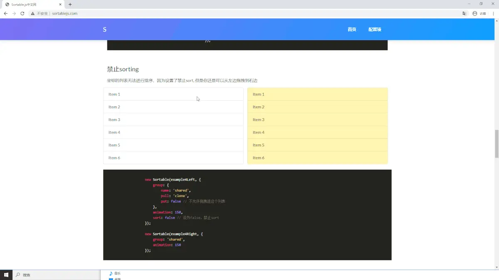

## 拖拽功能实现

vdesjs的拖拽功能使用到了vuedraggble，vuedragable的实现是基于[sortable.js](http://www.sortablejs.com/),我们可以进入其官网体验禁止sorting模式。如下图所示：


那么禁止sorting模式正好符合我们需要的拖拽功能，可以由左侧拖拽至右侧，右侧禁止拖拽至左侧，右侧的上下可以自由拖拽排列。

拖拽功能有了，那么就要考虑到后续组件的属性编辑与代码生成了。vuedraggble允许我们为组件去绑定json对象，比如我们从左侧拖拽至右侧可以理解为将就左侧绑定的json对象复制到右侧中，右侧的上下左右排序也可以理解为json对象在上下移动。vdesjs中部分dragaable的代码如下：


左侧拖拽面板中的draggable代码：
```javascript
<draggable
          class="Compoent"
          :list="basicCompoents"
          :clone="cloneCompoents"
          :options="{
            sort: false,
          }"
          :group="{ name: 'components', pull: 'clone', put: false }"
        >
          <component-container
            v-for="(item, i) in basicCompoents"
            :key="i"
            :componentName="item.componentName"
            :name="item.name"
          >
          </component-container>
        </draggable>


```
上述代码解析：
* :list 为绑定的json对象数据
* :group中 name代表draggable的名称，如想从左侧拖拽至中间的展示面板，那么必须要设置成相同的。 pull设置成clone代表从左侧是复制一份相同的至中间， put设置成false代表不可以从其他draggable中放入这里。
* :clone中设置的方法，是当拖拽完成则会执行。（vdesjs在此处为组件对象设置全局唯一id）
* compoent-container为vdesjs中自定义的组件，其根据传入的组件名称，来渲染左侧面板应该显示的界面。


中间展示面板中的draggable代码：
```javascript
<draggable
        :list="list"
        group="components"
        class="draggableDiv"
      >
        <div
          v-for="(item, i) in list"
          :key="i"
          
          class="content"
        >
        <div v-if="item.componentName == 'VanLayout'">
            <van-layout  :listIndex="i"></van-layout>
        </div>
        <component
        @click.native="switchIndex(i)"
         v-else
          class="hoverborder"
          :is="item.componentName"
          :myItem="item"
        ></component>
        </div>
      </draggable>
```
上述代码解析:
* 中间面板中会判断是否是布局组件还是其他组件（因为布局组件相比较特殊，需要往每个列中放入draggable，来实现往布局中拖入组件）


## json数据设计
该项目的拖拽本质上是json对象的移动复制，这里以基础组件的按钮json对象为例：
```javascript
 basicCompoents: [
        {
          name: "按钮",
          id: "唯一值",
          componentName: "VanButton",
          mStyle: {},
          mClass: [],
          propValues: [
            {
              label: "标题",
              key: "title",
              value: "按钮",
              type: "text",
            },
            {
              label: "按钮类型",
              key: "type",
              type: "select",
              value: {
                chooseValue: "",
                data: [
                  {
                    value: "primary",
                    label: "主要按钮",
                  },
                  {
                    value: "info",
                    label: "信息按钮",
                  },
                  {
                    value: "default",
                    label: "默认按钮",
                  },
                  {
                    value: "warning",
                    label: "警告按钮",
                  },
                  {
                    value: "danger",
                    label: "危险按钮",
                  },
                ],
              },
            },
            {
              label: "按钮颜色",
              key: "color",
              type: "color",
              value: "#656262",
            },
          ],
        },
        
      ],
```

上述代码解析
* name 设置组件左侧面板中的展示名称
* componentName 设置组件的名称
* propValues 设置右侧面板的可以配置属性。每个项中的type属性决定右侧面板的类型。
  


## 代码生成功能
代码生成选择了handlerbars作为模板引擎，用于将json数据根据每个组件对应编写的模板代码转换成可使用的代码。
如需了解handlerbars语法可前去[handlebars中文网](https://www.handlebarsjs.cn/)。

这里展示编写vdesjs代码模板所必须的模板语法：

* 数据获取
```javascript    
    {{myItem.propValues.[1].value}}

    //
  ```
上述代码注意:  数据获取通过{{}}包围起来获取变量的值， 其中数组是通过.[index] 的方式来获取

* 循环
```javascript
{{#each myItem.propValues.[0].value.data}}
        <van-grid-item icon="{{icon}}" text="{{name}}" />
{{/each}}

// 上述代码注意： 注意在each中是有对应的上下文的，如果在each中想使用外部的上下文，可通过 ../ 来获取， 如 {{../myItem.propValues.[1].value.num}} 这样的形式。
```


* 判断
```javascript
  {{#compare myItem.propValues.[0].value.chooseValue '==' 'multiple'}}
  <van-cell title="选择多个日期" :value="date{{myItem.id}}" @click="show = true" />
    <van-calendar
      show-confirm="{{myItem.propValues.[1].value}}"
      color="{{myItem.propValues.[2].value}}"
      v-model="show{{myItem.id}}"
      type="multiple"
      @confirm="onConfirmMultiple{{myItem.id}}"
    />
  {{/compare}}
```
上述代码注意: handlebars原始是不支持判断语法的，vdesjs中是通过自定义helper来扩展判断的。

